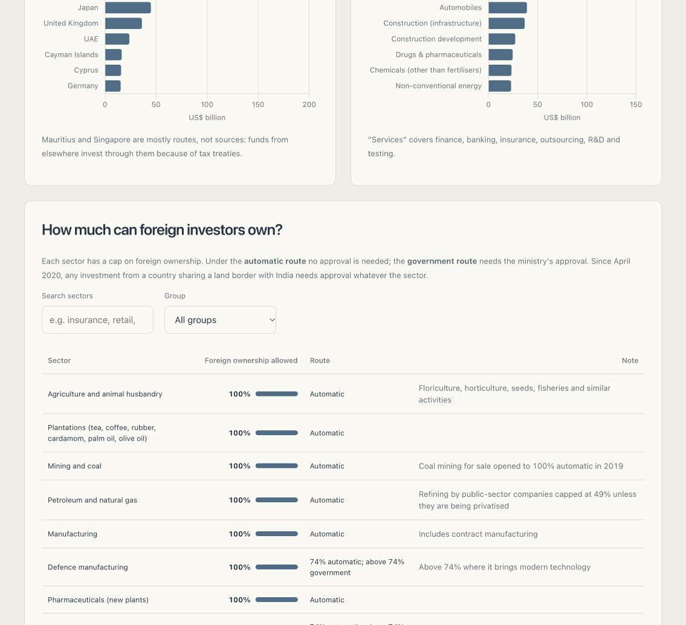
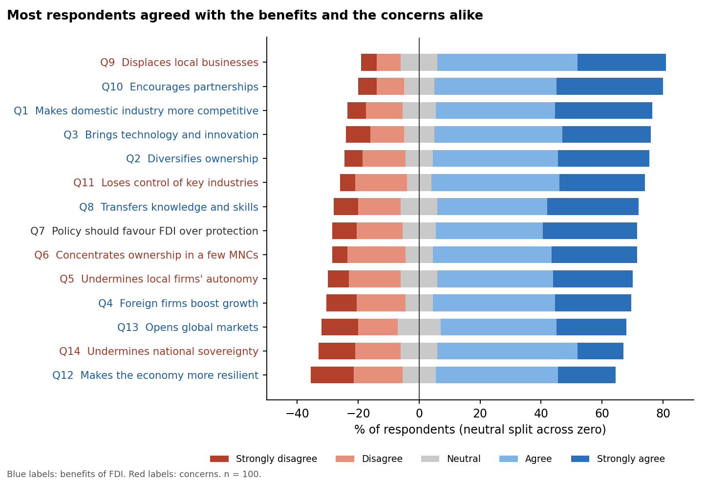

# FDI and Changing Dimensions of Ownership

How foreign direct investment into India, and the rules on how much of an Indian business foreigners may own, have changed since 2000, with a survey of how employees of multinational companies see FDI's effects.

**Dashboard:** https://harsh-github007.github.io/FDI-and-Changing-Dimensions-of-Ownership/
**Research paper:** [FDI and Changing Dimensions of Ownership: Evidence from India, 2000–2026](research/fdi-and-changing-dimensions-of-ownership.pdf), written in the Springer Nature journal article format ([LaTeX source](research/fdi-and-changing-dimensions-of-ownership.tex))




An editorial navy-and-ivory interface guides readers from capital flows to investment destinations and ownership limits. Period controls compare cumulative and recent inflows; sector search and grouping help readers navigate the ownership table. Charts adapt to mobile screens, and section navigation respects reduced-motion preferences.

## Key findings

- **Record inflows.** Total FDI inflows reached US$94.8 billion in 2025-26, up 18% on the year and 23 times the 2000-01 level.
- **Most of it flows back out.** Foreign investors repatriated US$53.6 billion in 2025-26 and Indian companies invested US$33.3 billion abroad, leaving net FDI of US$7.7 billion. Net FDI fell from US$28.0 billion in 2022-23 to US$1.0 billion in 2024-25, as foreign owners sold stakes, some through listings such as Hyundai Motor India's and LG Electronics India's.
- **Half comes through two countries.** Mauritius and Singapore supplied 48% of equity inflows from 2000 to 2025, mostly as routes for funds based elsewhere. Investment from the United States doubled in 2025-26.
- **Ownership limits have moved almost only one way.** Insurance went from 26% foreign ownership (2000) to 49%, 74% and 100% (2025); defence, telecom, retail and space followed. News media and multi-brand retail remain the main exceptions.
- **The new limit is on who, not how much.** Since April 2020, any investment from a country sharing a land border with India needs approval; since March 2026, decisions are due within 60 days.
- **Employees of multinationals see both sides.** In a survey of 100, about two-thirds agreed with each of FDI's benefits and about two-thirds with each of its costs. At least 46% agreed both that FDI makes domestic industry more competitive and that it displaces local businesses.

## The dashboard

A single page that works on any device:
- **Money coming in:** inflows by financial year since 2000-01, split into new equity and reinvested earnings.
- **Money going out:** gross inflows against repatriation, outward investment and net FDI.
- **Where it comes from and where it goes:** top countries and sectors, since 2000 or for 2025-26.
- **How much can foreign investors own:** a searchable table of the ownership limit and approval route for 37 sectors, and a timeline of changes since 1991.
- **What employees think:** answers to all 14 survey statements.

The page reads its numbers from the CSV files in [`data/`](data/) and [`survey/`](survey/), the same files the paper uses.

## The survey

100 employees of multinational companies in India, at associate level and above, rated 14 statements on a five-point scale: eight about FDI's benefits, five about its costs and one on policy. [`survey/analyze.py`](survey/analyze.py) reports the share agreeing with 95% confidence intervals, sign tests adjusted for 14 comparisons, and the smallest share of respondents who must have agreed with a benefit and a cost at once. Results are in [`survey/results.md`](survey/results.md).



## Data

| File | Contents | Source |
| --- | --- | --- |
| `data/fdi_inflows_by_year.csv` | Equity and total FDI inflows, 2000-01 to 2025-26 | DPIIT; 2025-26 from DPIIT data as reported and the Ministry of Finance |
| `data/net_fdi.csv` | Gross inflows, repatriation, outward FDI and net FDI, 2022-23 to 2025-26 | RBI, as reported by Business Standard |
| `data/top_countries.csv`, `data/top_sectors.csv` | Top 10 countries and sectors since 2000, and 2025-26 where available | DPIIT |
| `data/sector_caps.csv` | Ownership limit and approval route by sector, September 2026 | DPIIT consolidated FDI policy and later press notes |
| `data/policy_timeline.csv` | Changes to ownership limits since 1991 | As above |
| `survey/survey_counts.csv` | Answer counts for the 14 survey statements | Primary survey |

The full source list is in the paper. The ownership limits are summarised; check the current DPIIT policy before relying on them.

## Running it

```bash
python -m http.server 8000                 # then open http://localhost:8000
npm test                                   # checks the data files and headline figures (Node 18+)
python survey/analyze.py                   # re-run the survey analysis (pandas, matplotlib)
python research/figures/make_figures.py    # redraw the paper's charts
cd research && latexmk -pdf fdi-and-changing-dimensions-of-ownership.tex   # rebuild the paper (TeX Live)
```

The site is static HTML, CSS and JavaScript with no build step; [Chart.js](https://www.chartjs.org/) is included in `assets/vendor/`. GitHub Pages publishes it from the `main` branch on every push.

## Project layout

```
index.html, assets/     the dashboard
data/                   FDI flows, countries, sectors, ownership limits and policy timeline (CSV)
survey/                 survey counts, analysis script, results and chart
research/               the research paper (Springer Nature LaTeX source and PDF) and its charts
tests/                  tests for the data files
```
