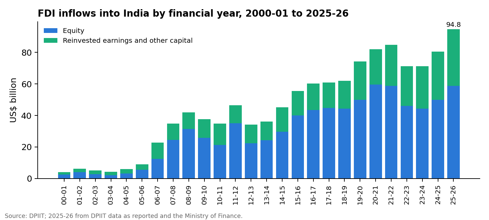
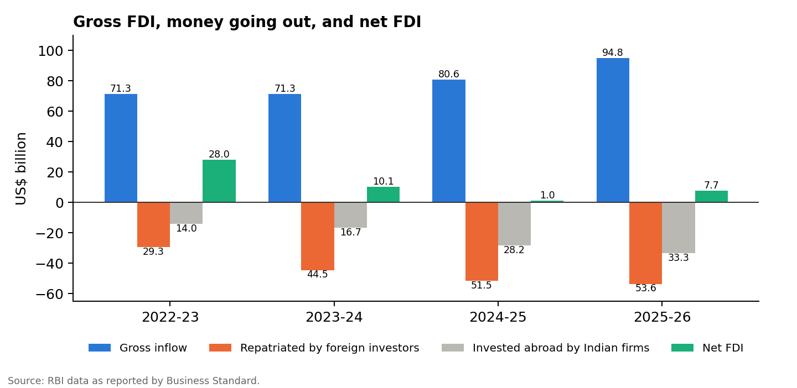

# FDI and Changing Dimensions of Ownership: Evidence from India, 2000–2026

*Harsh Raj · September 2026*

*The data, charts and survey analysis behind this paper are published with it: [dashboard](https://harsh-github007.github.io/FDI-and-Changing-Dimensions-of-Ownership/), [data](../data/), [survey analysis](../survey/analyze.py).*

## Executive Summary

Foreign direct investment (FDI) is investment by which a foreign company or fund takes a lasting interest in a business, conventionally 10% or more of its equity. Portfolio investment only buys shares. FDI changes who owns and controls companies, which is why its rules are written as limits on ownership:

- how much of a sector foreigners may own;
- whether they need approval;
- and, since 2020, which countries they may come from.

This study looks at how FDI into India and the rules on foreign ownership have changed since 2000, and at what employees of multinational companies think of FDI's effects. It combines three things:

- official data on inflows, outflows, source countries and sectors, from April 2000 to March 2026;
- a review of the ownership limits sector by sector and how they have moved since 1991;
- a survey of 100 employees of multinational companies in India.

The main findings:

1. **Inflows reached a record in 2025-26.** Total FDI inflows were US$94.8 billion, up 18% on the year and 23 times the 2000-01 level. New equity accounted for US$58.9 billion; the rest was reinvested earnings and other capital.
2. **Much of the money flows back out.** In 2025-26, foreign investors repatriated US$53.6 billion and Indian companies invested US$33.3 billion abroad, leaving net FDI of only US$7.7 billion. Net FDI had fallen from US$28.0 billion in 2022-23 to US$1.0 billion in 2024-25. Foreign owners are increasingly selling stakes they built up, often through share sales on the Indian stock market.
3. **Ownership limits have moved almost entirely one way, towards more foreign ownership.** Insurance went from 26% (2000) to 49% (2015), 74% (2021) and 100% (2025). Defence, telecom, retail and space have followed similar paths. The main exceptions are news media and multi-brand retail.
4. **The new limit is on who owns, not how much.** Since April 2020, investment from any country sharing a land border with India needs government approval, whatever the sector. In March 2026 the government set a 60-day deadline for those decisions.
5. **Employees of multinationals see both sides.** About two-thirds agreed with each of the eight statements about FDI's benefits, and about two-thirds with each of the five statements about its costs. At least 46% agreed both that FDI makes domestic industry more competitive and that it displaces local businesses.

## Chapter 1: Introduction

### 1.1 Research background

A foreign company can enter a country in three main ways:

- **Greenfield investment:** building a new business from scratch, and owning all or most of it.
- **Joint venture:** sharing ownership with a local partner.
- **Acquisition (brownfield investment):** buying an existing local company, in part or in full.

Each gives the foreign investor a different degree of control, and each changes who owns the host country's industry in a different way. A greenfield plant adds new capacity under foreign ownership. An acquisition moves existing capacity from local to foreign hands. A joint venture divides control.

For most of the period after independence, India kept foreign ownership low: companies with more than 40% foreign equity were restricted under the Foreign Exchange Regulation Act of 1973, and several multinationals left rather than dilute their stakes. The New Industrial Policy of 1991 reversed this, allowing automatic approval of up to 51% foreign ownership in 34 priority industries. Since 2000, most sectors have been open under the **automatic route**, needing only notification to the Reserve Bank of India (RBI). The rest need **government approval**, and a short list is closed to foreign investment altogether. The Foreign Investment Promotion Board, which approved investments case by case, was abolished in 2017, and approvals passed to the ministries.

Three developments have changed the picture since.

- **Who invests has changed.** Private equity funds, sovereign wealth funds and pension funds now account for a large share of FDI. They buy stakes to sell later, so ownership turns over faster than when most FDI came from multinationals building their own subsidiaries.
- **Foreign owners now sell out through the Indian stock market.** Hyundai Motor India's listing in October 2024 raised ₹27,870 crore, all of it from the Korean parent selling 17.5% of its shares. LG Electronics sold 15% of its Indian unit the same way in October 2025 [12].
- **Indian companies have become foreign owners themselves.** Outward FDI from India more than doubled between 2022-23 and 2025-26.

### 1.2 Research problem

Most discussion of FDI in India focuses on gross inflows, which have risen almost every year. But ownership is shaped by what leaves as well as what arrives, and by the rules on who may own what. This study asks three questions:

1. How have the volume, sources and destinations of FDI into India changed since 2000?
2. How have the limits on foreign ownership changed, and in which direction?
3. How do people working inside multinational companies see FDI's effect on domestic ownership and industry?

## Chapter 2: Objectives and Scope of the Study

### 2.1 Objectives

1. To analyse trends in FDI into India from 2000-01 to 2025-26, including the gap between gross and net FDI.
2. To identify the factors changing the ownership of Indian businesses, including sector limits, restrictions by country of origin, and exits by foreign owners.
3. To evaluate how employees of multinational companies perceive the effects of FDI on domestic industry and ownership.
4. To make recommendations for policymakers and businesses.

### 2.2 Scope of the study

The study covers India, from the start of the DPIIT's consolidated data series in April 2000 to March 2026 for flows, and to September 2026 for policy. It covers all sectors of the economy, with closer attention to those whose ownership limits have changed: insurance, defence, telecom, retail, space and media. The survey covers employees of multinational companies at associate level and above.

## Chapter 3: Review of Literature

### 3.1 Why firms invest abroad

**Hymer (1976)** argued that a foreign firm starts at a disadvantage against local competitors, who know the market, so it will invest abroad only if it has an advantage of its own, such as technology, a brand or scale, large enough to overcome that handicap. FDI is therefore about control, not just capital.

**Dunning (1981, 2000)** built this into the eclectic or OLI paradigm. A firm invests abroad when three advantages come together:

- **Ownership:** assets its rivals lack.
- **Location:** reasons to produce in the host country rather than export to it.
- **Internalisation:** reasons to use those assets itself rather than license them to a local firm.

Dunning's investment development path (1981) links a country's net FDI position to its stage of development:

1. Poor countries receive little FDI.
2. Developing countries receive much more than they invest abroad.
3. As domestic firms build their own ownership advantages, outward investment rises.
4. Eventually net FDI turns towards zero or becomes negative.

India's falling net FDI, with outward investment rising, fits the later stages of this path.

**Buckley and Casson (2009)**, reviewing thirty years of internalisation theory, emphasised that the choice between owning and contracting depends on the costs of transacting in imperfect markets for knowledge.

**Caves (1996)** surveyed the economics of the multinational enterprise, including how host-country ownership limits push foreign firms into joint ventures they would not otherwise choose.

### 3.2 Ownership structure and the host country

**Meyer, Mudambi and Narula (2011)** describe multinationals as embedded both in their global network and in each local context. The ownership form they choose, whether a wholly owned subsidiary, a joint venture or an acquisition, reflects how much they need local partners' knowledge and legitimacy.

**Cantwell and Mudambi (2005)** show that some subsidiaries go beyond using the parent's technology and create new competences of their own. This makes technology transfer to the host country more likely when subsidiaries are given research mandates.

**Rugman and Verbeke (2004)** found that most large multinationals earn most of their sales in their home region. Few are truly global, which qualifies the idea that FDI makes ownership borderless.

### 3.3 Emerging-market multinationals

**Ramamurti (2012)** asked what is different about multinationals from emerging markets such as India and China. His answer: they often compete on cost, on the ability to operate in difficult institutional environments, and on acquisitions that buy technology and brands abroad.

**Contractor, Kumar and Kundu (2007)** studied Indian firms and found that the link between international expansion and performance is S-shaped: gains come only after an initial phase of costly learning.

These studies help explain the rapid rise of Indian outward FDI documented in Chapter 5.

### 3.4 Institutions, governance and distribution

**Cuervo-Cazurra (2006)** showed that corruption in a host country deters FDI, especially from countries that have signed the OECD Anti-Bribery Convention. The quality of institutions, not just their rules, shapes who invests.

**Helpman (2018)** reviews the evidence on globalisation and inequality. He finds that trade and FDI have raised inequality within countries, but by less than is often assumed.

**UNCTAD's World Investment Report 2020** documented the collapse of global FDI in the pandemic and the spread of investment screening, of which India's 2020 rule on neighbouring countries is one example.

### 3.5 Earlier Indian studies

Most studies of FDI in India measure gross inflows and their links with growth, productivity and exports. Two recent developments have received little attention: the gap between gross and net FDI, which has become large only since 2023, and restrictions based on the investor's country of origin, introduced in 2020. This study addresses both.

## Chapter 4: Research Methodology

**Research design.** Descriptive. The study uses secondary data to describe FDI flows and ownership rules, and primary data from a survey to describe perceptions.

**Secondary data:**

- Financial-year inflows since 2000-01, and cumulative inflows by country and sector, are taken from the DPIIT's FDI factsheet to June 2025 [1].
- 2025-26 inflows by country and sector come from DPIIT data as reported by India Briefing [2]; total inflows for 2025-26 are from the Ministry of Finance [3].
- Gross, repatriated, outward and net FDI are from RBI data as reported by Business Standard [4, 5, 6].
- Ownership limits come from the DPIIT's consolidated FDI policy and later press notes, the government's statement on the insurance amendment [7], the space policy of 2024, and the Cabinet decision of 10 March 2026 [8].

All the data are published with this paper as CSV files.

**Primary data:**

- **Instrument:** a structured questionnaire of 14 closed statements, answered on a five-point Likert scale (5 strongly agree to 1 strongly disagree).
- **Themes:** eight statements describe benefits of FDI, five describe concerns, and one asks whether policy should favour attracting FDI over protecting domestic industry.
- **Sample:** 100 employees of multinational companies in India, at associate, supervisory and higher levels, chosen by convenience sampling.

**Analysis:**

- For each statement, the share agreeing (agree or strongly agree) is reported with a 95% Wilson confidence interval, along with the share disagreeing and the mean score.
- A two-sided sign test checks whether agreement outweighs disagreement (neutral answers left out), with Holm's adjustment for testing 14 statements.
- Only the count of answers for each statement was retained, not each respondent's full set of answers. So the analysis cannot correlate one statement with another. Instead it reports the smallest share of respondents who *must* have agreed with two statements at once: if a% agreed with one and b% with another, at least a + b − 100% agreed with both.

## Chapter 5: Data Analysis and Findings

### 5.1 Inflows since 2000

FDI into India has grown in four phases:

1. **Small, to 2005-06.** Total inflows stayed under US$10 billion a year.
2. **A jump in 2006-09.** Inflows reached US$41.9 billion in 2008-09, following the opening of construction, telecom and retail.
3. **A plateau of US$34–47 billion to 2013-14.**
4. **Steady growth from 2014-15.** Inflows reached US$84.8 billion in 2021-22, dipped to about US$71 billion in 2022-24 as global interest rates rose, then rose to US$80.6 billion in 2024-25 and a record **US$94.8 billion in 2025-26**.

In 2025-26, 62% of inflows were new equity (US$58.9 billion) and 38% were reinvested earnings and other capital. That is money foreign-owned companies already in India earned and kept there, which raises foreign ownership without any new foreign money arriving.

| | 2000-01 | 2010-11 | 2020-21 | 2024-25 | 2025-26 |
| --- | ---: | ---: | ---: | ---: | ---: |
| Total FDI inflow (US$ bn) | 4.0 | 34.8 | 82.0 | 80.6 | 94.8 |
| Equity inflow (US$ bn) | 2.5 | 21.4 | 59.6 | 50.0 | 58.9 |

*Sources: DPIIT [1]; 2025-26 from [2, 3].*

### 5.2 Where FDI comes from

From April 2000 to June 2025, **Mauritius (24.4%) and Singapore (24.0%) together supplied almost half of all equity inflows** [1], followed by the United States (10.2%), the Netherlands (7.2%) and Japan (6.0%). Mauritius and Singapore are mostly conduits rather than sources: their tax treaties with India made them the natural base for global funds.

After the treaties were amended in 2016 to let India tax capital gains on shares bought from April 2017, Mauritius's lead faded. In 2025-26 Singapore supplied 34% of equity inflows (US$19.8 billion) and Mauritius 11% (US$6.6 billion). Direct investment from the **United States doubled, from US$5.5 billion to US$11.2 billion**, to 19% of the total [2].

This routing means the true owners behind much of India's FDI are not visible in the country data. Knowing who ultimately controls an investment has become part of the policy question since the 2020 rule on neighbouring countries, which applies to the *beneficial* owner, not the immediate investor.

### 5.3 Where FDI goes

Since 2000, **services** (finance, banking, insurance, outsourcing and R&D; 16.3%) and **computer software and hardware** (15.5%) have received almost a third of equity inflows. They are followed by trading (6.4%), telecom (5.4%), automobiles (5.2%) and infrastructure construction (4.9%) [1].

In 2025-26, software and hardware became the largest destination, at US$13.9 billion (24% of equity), up from US$7.8 billion a year earlier. Services received US$10.0 billion and renewable energy US$3.0 billion [2]. FDI is concentrated geographically too: Maharashtra (US$18.4 billion) and Karnataka (US$12.9 billion) received more than half of 2025-26 equity inflows.

### 5.4 How ownership limits have changed

| Year | Sector | Change |
| --- | --- | --- |
| 1991 | All industries | Automatic approval up to 51% in 34 priority industries |
| 2000 | All industries | The automatic route becomes the default; insurance opened at 26% |
| 2012 | Retail | Single-brand retail to 100%; multi-brand retail opened at 51% with approval |
| 2014 | Defence, railways | Defence from 26% to 49%; railway infrastructure 100% automatic |
| 2015 | Insurance | 26% to 49% |
| 2016 | Defence, aviation, e-commerce | Defence above 49% with approval; scheduled airlines 49% automatic, 100% with approval; e-commerce marketplaces 100% |
| 2017 | All industries | Foreign Investment Promotion Board abolished |
| 2018 | Single-brand retail | 100% automatic |
| 2019 | Coal, contract manufacturing, digital media | 100% automatic for coal and contract manufacturing; digital news media capped at 26% |
| 2020 | Countries sharing a land border | All investment needs government approval (Press Note 3) |
| 2020 | Defence | Automatic route from 49% to 74% |
| 2021 | Insurance, telecom | Insurance 49% to 74%; telecom 100% automatic |
| 2024 | Space | Satellites 74% automatic; launch vehicles 49% automatic; components 100% automatic |
| 2025 | Insurance | 74% to 100% (Act passed 17 December 2025) [7] |
| 2026 | Countries sharing a land border | 60-day deadline for approval decisions (10 March 2026) [8] |

Three patterns stand out.

- **The direction has been almost entirely one way.** The only new sector cap in this period was on digital news media, set at 26% in 2019; otherwise limits have only risen. Insurance shows the typical path: a low cap to start, then step-by-step increases as domestic firms mature and regulation strengthens.
- **Caps have become tiered.** In many sectors foreign ownership is allowed automatically up to a first threshold and with approval above it. Examples are defence (74% automatic, 100% with approval), private banks (49% and 74%) and launch vehicles (49% and 100%). The state keeps a say over control without closing the sector.
- **Some sectors stay protected.** News media (26% for print and digital, 49% for television) and multi-brand retail (51%, with approval) have barely moved. The reasons are political: the influence of news media and the livelihoods of small traders.

The most important change since 2020 is a new *dimension* of ownership. Press Note 3 made the investor's country of origin, rather than the sector, the basis for approval. It was introduced in April 2020 to prevent opportunistic takeovers of Indian companies weakened by the pandemic, and in practice it applies mainly to China. It brought many investments from Chinese companies and funds to a halt. The 60-day deadline set in March 2026 keeps the screening but limits the delay it causes [8].

### 5.5 Money going out: gross versus net FDI

| US$ billion | 2022-23 | 2023-24 | 2024-25 | 2025-26 |
| --- | ---: | ---: | ---: | ---: |
| Gross FDI inflow | 71.3 | 71.3 | 80.6 | 94.8 |
| Repatriated by foreign investors | 29.3 | 44.5 | 51.5 | 53.6 |
| Invested abroad by Indian firms | 14.0 | 16.7 | 28.2 | 33.3 |
| **Net FDI** | **28.0** | **10.1** | **1.0** | **7.7** |

*Sources: RBI data reported in [4, 5, 6]. Figures are revised over time, so items may not add exactly.*

Between 2022-23 and 2025-26:

- **Gross inflows rose by a third.**
- **Money repatriated by foreign investors rose 83%.** In 2022-23 foreign investors took out 41% of what came in; in 2025-26 they took out 57%.
- **Outward investment by Indian companies more than doubled.**
- **Net FDI fell from US$28.0 billion to US$1.0 billion in 2024-25,** the lowest in at least two decades, before recovering to US$7.7 billion.

Much of the repatriation reflects foreign owners selling stakes they built up in earlier years:

- private equity funds exiting through sales to strategic buyers;
- foreign parents selling part of their Indian subsidiaries on the stock market, like Hyundai (₹27,870 crore, October 2024) and LG Electronics (₹11,600 crore, October 2025) [12].

When a foreign parent sells shares to Indian investors in this way, ownership of the company moves from foreign to domestic hands. The company still operates in India, but it now has Indian shareholders. The RBI has described this as the sign of a mature market that investors can enter and leave easily [5]. The rise in outward FDI is also consistent with Dunning's investment development path: Indian firms are becoming owners abroad.

The implication for analysis is that **gross FDI overstates the change in foreign ownership.** A record inflow in 2025-26 was accompanied by record repatriation, and net foreign ownership grew far less than the headline suggests.

### 5.6 Survey findings

| | Statement (in short; full wording in the Annexure) | Agree | 95% interval | Disagree | Mean (1–5) |
| --- | --- | ---: | ---: | ---: | ---: |
| Q10 | Encourages partnerships | 75% | 66–82% | 15% | 3.89 |
| Q9 | Displaces local businesses | 75% | 66–82% | 13% | 3.86 |
| Q1 | Makes domestic industry more competitive | 71% | 61–79% | 18% | 3.79 |
| Q2 | Diversifies ownership | 71% | 61–79% | 20% | 3.75 |
| Q3 | Brings technology and innovation | 71% | 61–79% | 19% | 3.73 |
| Q11 | Loses control of key industries | 70% | 60–78% | 22% | 3.71 |
| Q6 | Concentrates ownership in a few multinationals | 67% | 57–75% | 24% | 3.66 |
| Q7 | Policy should favour FDI over protection | 66% | 56–75% | 23% | 3.66 |
| Q8 | Transfers knowledge and skills | 66% | 56–75% | 22% | 3.66 |
| Q4 | Foreign firms boost growth | 65% | 55–74% | 26% | 3.54 |
| Q5 | Undermines local firms' autonomy | 64% | 54–73% | 24% | 3.59 |
| Q13 | Opens global markets | 61% | 51–70% | 25% | 3.47 |
| Q14 | Undermines national sovereignty | 61% | 51–70% | 27% | 3.37 |
| Q12 | Makes the economy more resilient | 59% | 49–68% | 30% | 3.34 |

*n = 100. Agreement exceeds disagreement for every statement (sign test, Holm-adjusted p ≤ 0.003).*

**Interpretation:**

- **Respondents agreed with the benefits and the concerns in equal measure.** Across the eight benefit statements, an average of 67% agreed; across the five concern statements, also 67%. The most agreed-with benefit, that FDI encourages partnerships (75%), was matched exactly by the most agreed-with concern, that FDI displaces local businesses (75%).
- **Many respondents must hold both views at once.** At least 46% agreed both that FDI makes domestic industry more competitive (Q1) and that it displaces local businesses (Q9). At least 50% agreed both that it encourages partnerships and that it displaces local businesses. These positions are not contradictory: competition from foreign firms can strengthen an industry while pushing its weaker local firms out. But they show that people working inside multinationals do not see FDI as simply good or bad.
- **Views on ownership were mixed.** 71% agreed that FDI diversifies ownership (Q2), yet 67% agreed that it concentrates ownership in a few multinationals (Q6). Both can be true of different sectors: FDI widens the range of owners in markets once dominated by a few domestic groups, while concentrating control in markets where global firms buy out local ones.
- **Two-thirds favoured attracting FDI over protecting domestic industry (Q7),** consistent with the one-way liberalisation of the limits in Section 5.4.
- **The weakest agreement concerned resilience (Q12, 59%) and sovereignty (Q14, 61%),** which also drew the most disagreement. These are the most abstract statements, and the ones where respondents were most divided.

**A caution:** every statement was worded so that agreeing meant holding the stated view, and agreement ranged only from 59% to 75%. Part of this pattern may be acquiescence, the tendency of survey respondents to agree with statements put to them. The retained data cannot separate genuine ambivalence from acquiescence. A future survey should include reverse-worded statements and keep each person's full set of answers.

## Chapter 6: Recommendations

**For policymakers:**

1. **Track net FDI and ownership, not only gross inflows.** Publish repatriation and outward investment by sector and by country with the quarterly inflow data, so the change in foreign ownership can be measured.
2. **Keep the direction of liberalisation predictable.** Step-by-step, pre-announced increases in limits, as in insurance, have attracted investment without sudden changes of control.
3. **Make screening by country of origin fast and transparent.** Keep to the 60-day deadline set in March 2026, and publish how many applications are approved and rejected.
4. **Improve the disclosure of ultimate owners.** With nearly half of FDI routed through Mauritius and Singapore, the country data do not show who owns Indian businesses.
5. **Keep reviewing the remaining protected sectors,** including news media and multi-brand retail, on explicit criteria rather than by default.

**For businesses:**

1. **Foreign investors:** tiered limits make joint ventures and minority stakes the practical route into defence, banking, space and media. Local partners bring the knowledge and legitimacy the literature says multinationals need.
2. **Indian firms:** partnerships with foreign investors are the main channel for technology and market access that respondents recognised. Retaining control is a matter of structuring the partnership, not of avoiding it.

**For further research:**

1. Collect respondent-level survey data, with reverse-worded statements and a sample that includes domestic firms, not only multinationals.
2. Study the effect of foreign-parent share sales, such as Hyundai's and LG's, on the governance and performance of Indian subsidiaries.
3. Measure how much of India's FDI is ultimately owned by residents of third countries, including India itself (round-tripping).

## Chapter 7: Conclusion

In the quarter-century since 2000, FDI into India has grown from US$4 billion a year to a record US$94.8 billion. The rules on foreign ownership have opened sector by sector, almost always in one direction. The dimensions of ownership have changed in three ways that headline inflows do not show:

- **Ownership now turns over.** Foreign owners, especially funds, increasingly sell what they built or bought, so that more than half of gross inflows in 2025-26 was offset by repatriation.
- **Foreign owners are selling to Indian investors** through the stock market, as Hyundai and LG have done, which moves ownership back to domestic hands without closing any business.
- **Who the owner is now matters as much as how much they own,** with approval required since 2020 for any investor from a neighbouring country.

The employees of multinational companies surveyed for this study reflected this complexity. Most agreed that FDI strengthens competition, brings technology and builds partnerships. Most also agreed that it displaces local businesses and concentrates control. For India the lesson is that FDI is not simply a matter of attracting more foreign capital. It changes who owns the economy, and the country needs to measure and manage that change.

## Limitations

- **The survey is small, drawn by convenience, and limited to employees of multinationals,** who may view FDI more favourably than others. Only answer counts for each statement were retained, so relationships between answers cannot be measured.
- **2025-26 data by country and sector are from news reports of DPIIT data,** and may be revised.
- **Net FDI figures are revised between releases,** so the components may not add exactly.
- **The ownership limits are summarised.** Many sectors carry further conditions, so the DPIIT's current consolidated policy should be consulted for any investment decision.

## References

**Data and policy sources**

1. [FDI Factsheet, up to June 2025](https://www.dpiit.gov.in/static/uploads/2025/11/602708cf0ad827db844b7db5d5af82e7.pdf), Department for Promotion of Industry and Internal Trade (DPIIT)
2. [India FDI Inflows Reach US$58.85 Bn in FY 2025-26](https://www.india-briefing.com/news/india-fdi-inflows-fy-2025-26-top-countries-sectors-states-45422.html/), India Briefing, citing DPIIT data released 3 June 2026
3. [India registers record gross FDI inflow of $94.84 billion in FY26](https://www.indiatribune.com/india-registers-record-gross-fdi-inflow-of-9484-billion-in-fy26), India Tribune, citing the Ministry of Finance's reply in the Rajya Sabha (28 July 2026)
4. [Net FDI into India rises sharply to $7.65 billion in FY26](https://www.business-standard.com/economy/news/net-fdi-into-india-rises-sharply-to-7-65-billion-in-fy26-rbi-data-126052201682_1.html), Business Standard, citing RBI data
5. [Net FDI into India falls to $0.4 bn in FY25 amid repatriation surge](https://www.business-standard.com/amp/markets/news/india-net-fdi-drops-fy25-despite-high-gross-inflows-repatriation-rises-125052200362_1.html), Business Standard, citing RBI data
6. [Net FDI declines by 62% to $10.5 billion in FY24](https://www.business-standard.com/amp/economy/news/net-fdi-in-india-declines-to-10-6-billion-in-fy24-shows-rbi-s-bulletin-124052101316_1.html), Business Standard, citing RBI data
7. [The Sabka Bima Sabki Raksha (Amendment of Insurance Laws) Bill, 2025 passed by Parliament; allows up to 100% FDI in insurance companies](https://www.pib.gov.in/PressReleasePage.aspx?PRID=2206011&reg=3&lang=1), Press Information Bureau
8. [Cabinet eases FDI norms for countries sharing land border with India](https://www.newsonair.gov.in/cabinet-eases-fdi-norms-for-countries-sharing-land-border-with-india), All India Radio News (10 March 2026)
9. [FDI sectoral caps: complete list, 2026](https://beaconfiling.com/blog/fdi-sectoral-caps-complete-list), Beacon Filing, used to cross-check current limits
10. Consolidated FDI Policy (2020) and subsequent Press Notes, DPIIT
11. UNCTAD (2020). *World Investment Report 2020: International Production Beyond the Pandemic.* United Nations.
12. [As NSE, Jio eye listings, what are India's biggest share offerings?](https://www.business-standard.com/markets/ipo/as-nse-jio-eye-listings-what-are-india-s-biggest-share-offerings-126091100398_1.html), Business Standard (September 2026)

**Literature**

13. Buckley, P. J., & Casson, M. C. (2009). The internalization theory of the multinational enterprise: A review of the progress of a research agenda after 30 years. *Journal of International Business Studies*, 40(9), 1563–1580.
14. Cantwell, J., & Mudambi, R. (2005). MNE competence-creating subsidiary mandates. *Strategic Management Journal*, 26(12), 1109–1128.
15. Caves, R. E. (1996). *Multinational Enterprise and Economic Analysis* (2nd ed.). Cambridge University Press.
16. Contractor, F. J., Kumar, V., & Kundu, S. K. (2007). Nature of the relationship between international expansion and performance: The case of emerging market firms. *Journal of World Business*, 42(4), 401–417.
17. Cuervo-Cazurra, A. (2006). Who cares about corruption? *Journal of International Business Studies*, 37(6), 807–822.
18. Dunning, J. H. (1981). Explaining the international direct investment position of countries: Towards a dynamic or developmental approach. *Weltwirtschaftliches Archiv*, 117(1), 30–64.
19. Dunning, J. H. (2000). The eclectic paradigm as an envelope for economic and business theories of MNE activity. *International Business Review*, 9(2), 163–190.
20. Helpman, E. (2018). *Globalization and Inequality.* Harvard University Press.
21. Hymer, S. H. (1976). *The International Operations of National Firms: A Study of Direct Foreign Investment.* MIT Press.
22. Meyer, K. E., Mudambi, R., & Narula, R. (2011). Multinational enterprises and local contexts: The opportunities and challenges of multiple embeddedness. *Journal of Management Studies*, 48(2), 235–252.
23. Ramamurti, R. (2012). What is really different about emerging market multinationals? *Global Strategy Journal*, 2(1), 41–47.
24. Rugman, A. M., & Verbeke, A. (2004). A perspective on regional and global strategies of multinational enterprises. *Journal of International Business Studies*, 35(1), 3–18.

## Annexure: Questionnaire

Respondents rated each statement from 5 (strongly agree) to 1 (strongly disagree).

1. FDI enhances the competitiveness of domestic industries.
2. FDI leads to a more diversified ownership structure in domestic markets.
3. FDI contributes to technological advancements and innovation in domestic industries.
4. The involvement of foreign-owned companies in domestic markets positively impacts overall economic growth.
5. FDI undermines the autonomy of local businesses.
6. FDI leads to the concentration of ownership in the hands of a few multinational corporations.
7. Government policies should prioritize attracting FDI over protecting domestic industries.
8. FDI fosters knowledge transfer and skill development within domestic workforce.
9. The rise of FDI results in the displacement of local businesses.
10. FDI encourages collaboration and partnership between domestic and foreign entities.
11. FDI leads to a loss of control over key industries within a country.
12. FDI promotes economic diversification and resilience in domestic markets.
13. FDI facilitates access to global markets for domestic businesses.
14. FDI undermines national sovereignty by allowing foreign entities to exert influence over local economies.
